# Architecture Deep Dive

## Table of Contents
- [System Overview](#system-overview)
- [Component Architecture](#component-architecture)
- [Data Flow](#data-flow)
- [AI Pipeline](#ai-pipeline)
- [Database Schema](#database-schema)
- [API Specifications](#api-specifications)
- [Security Considerations](#security-considerations)
- [Scalability & Performance](#scalability--performance)

---

## System Overview

Shadow Worker follows a modern **microservices-inspired architecture** with clear separation between presentation, business logic, and AI services.

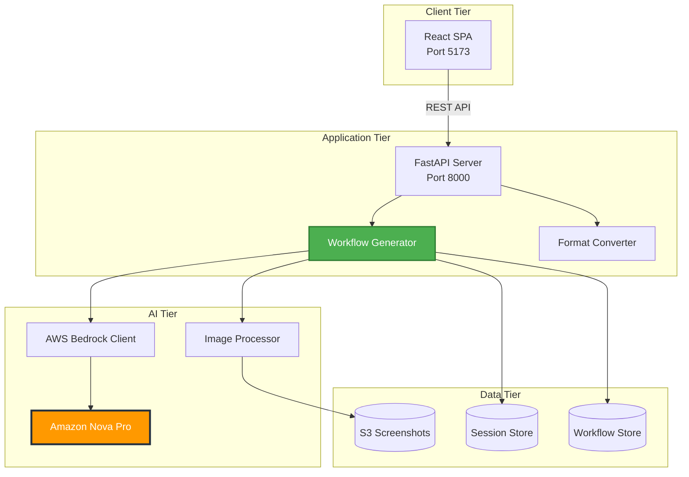

---

## Component Architecture

### Frontend Components

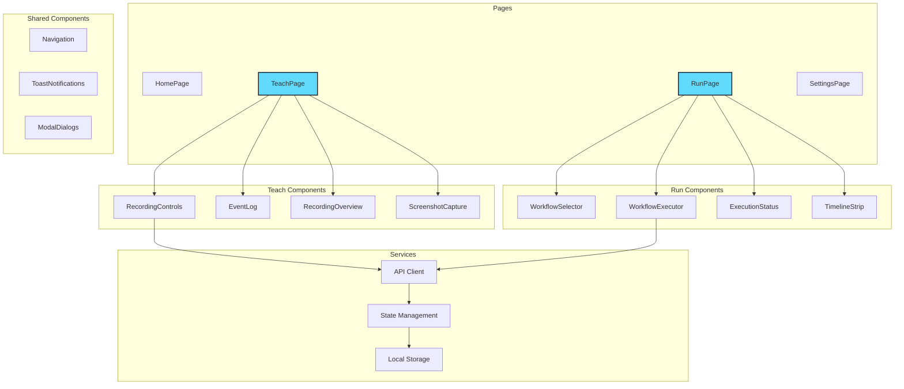

### Backend Architecture

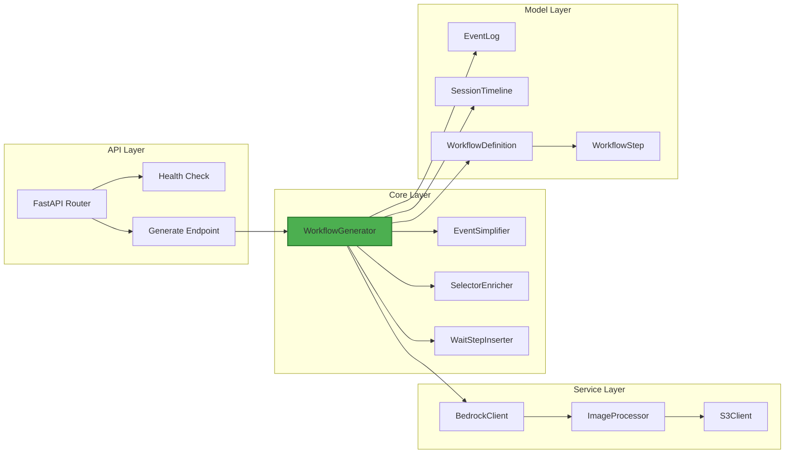

---

## Data Flow

### Recording Flow

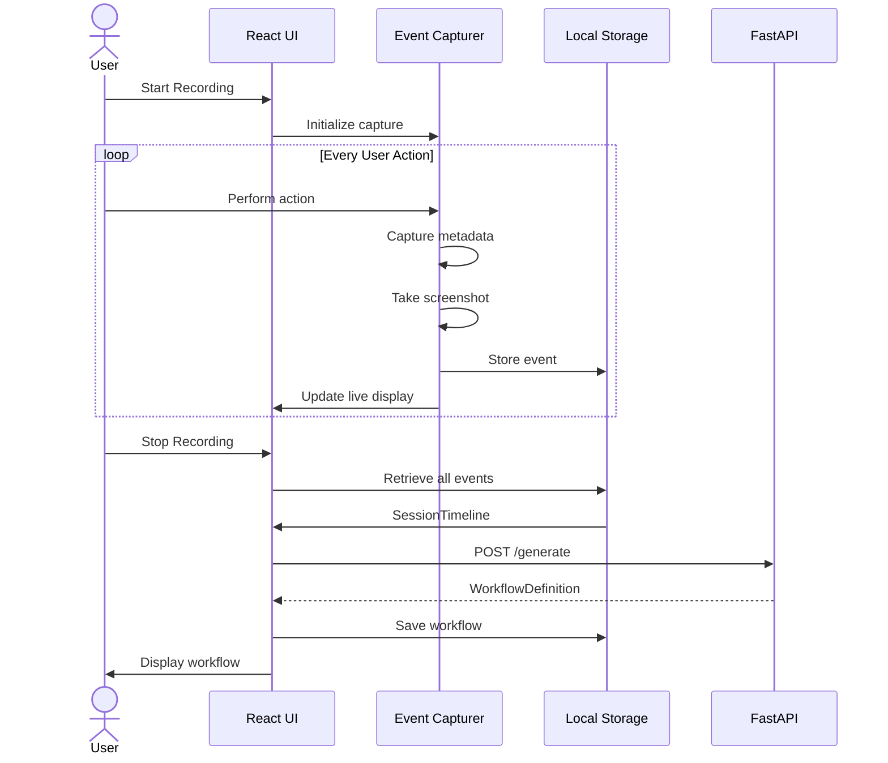

### Workflow Generation Flow

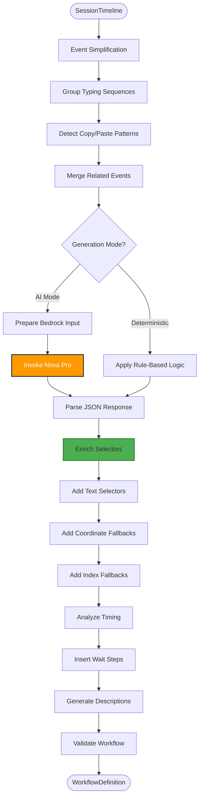

### Execution Flow

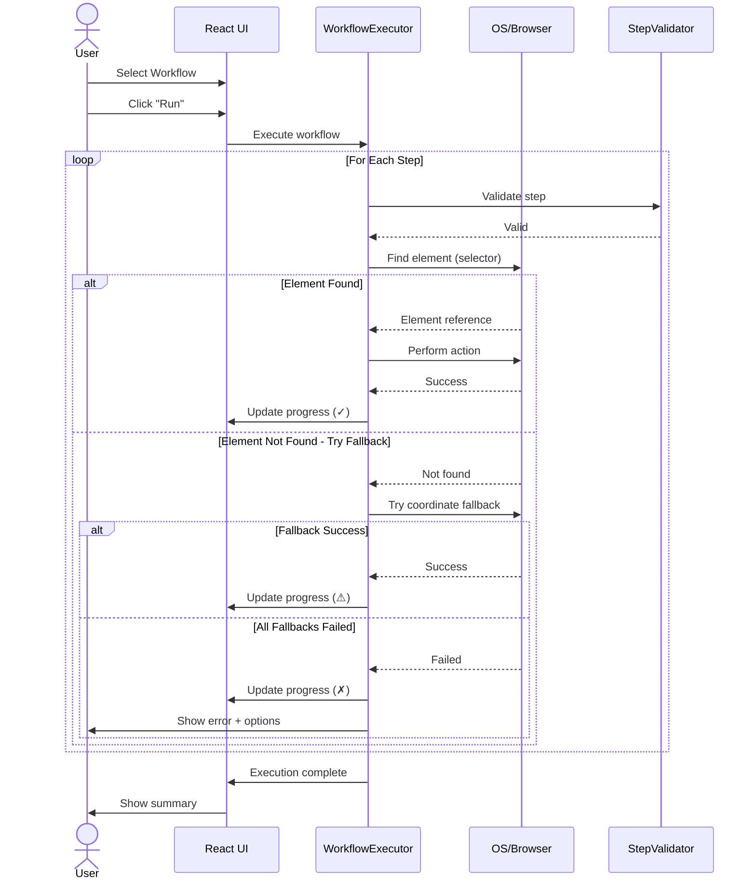

---

## AI Pipeline

### Prompt Engineering Architecture

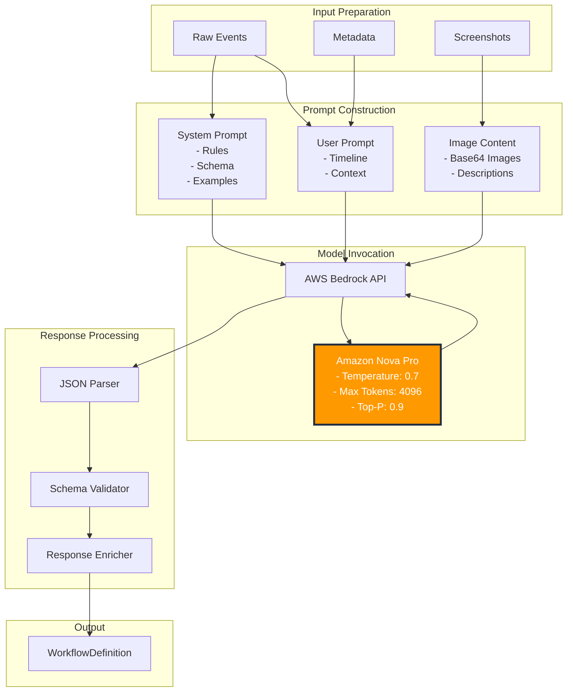

### Multimodal Processing

**Text Processing:**
```python
{
  "event_type": "MOUSE_CLICK",
  "timestamp": "2024-01-15T10:30:45Z",
  "details": {
    "coordinates": {"x": 450, "y": 200},
    "element_name": "Login Button",
    "element_type": "button"
  }
}
```

**Vision Processing:**
```python
{
  "type": "image",
  "source": {
    "type": "base64",
    "media_type": "image/png",
    "data": "iVBORw0KG..."
  }
}
```

**Fusion Output:**
```json
{
  "action": "CLICK",
  "selector": {
    "type": "text",
    "value": "Login Button",
    "fallback_coordinates": {"x": 450, "y": 200}
  },
  "description": "Click the login button to authenticate"
}
```

---

## Database Schema

### EventLog Schema

```typescript
interface EventLog {
  event_type: 'MOUSE_CLICK' | 'TEXT_INPUT' | 'KEY_PRESS' |
              'KEY_COMBINATION' | 'SCROLL' | 'MOUSE_DRAG' |
              'NAVIGATION' | 'WINDOW_SWITCH';
  timestamp: DateTime;
  details: {
    // Mouse events
    coordinates?: { x: number; y: number };
    button?: 'left' | 'right' | 'middle';
    click_type?: 'single' | 'double';

    // Keyboard events
    text?: string;
    key?: string;
    modifiers?: string[];

    // Scroll events
    direction?: 'up' | 'down' | 'left' | 'right';
    delta?: number;

    // Navigation events
    url?: string;
    title?: string;
  };
  screenshot_path?: string;
  element_metadata?: {
    tag_name?: string;
    id?: string;
    class_names?: string[];
    text_content?: string;
    attributes?: Record<string, string>;
  };
}
```

### WorkflowDefinition Schema

```typescript
interface WorkflowDefinition {
  workflow_name: string;
  description: string;
  created_at: DateTime;
  updated_at: DateTime;
  version: string;

  steps: WorkflowStep[];

  metadata: {
    source_session_id?: string;
    generation_mode?: 'ai' | 'deterministic';
    model_version?: string;
    tags?: string[];
    estimated_duration_seconds?: number;
  };
}

interface WorkflowStep {
  step_number: number;
  action: 'CLICK' | 'TYPE_TEXT' | 'PRESS_KEY' | 'SCROLL' |
          'DRAG' | 'WAIT' | 'NAVIGATE' | 'SCREENSHOT' |
          'VERIFY' | 'EXTRACT';

  selector?: {
    type: 'text' | 'coordinates' | 'xpath' | 'css';
    value: string;
    fallback_coordinates?: { x: number; y: number };
    fallback_index?: number;
  };

  parameters: {
    // Type-specific parameters
    text?: string;
    key?: string;
    duration_ms?: number;
    url?: string;
    // ... etc
  };

  description: string;
  estimated_duration_ms?: number;
  retry_config?: {
    max_retries: number;
    retry_delay_ms: number;
  };
}
```

---

## API Specifications

### REST Endpoints

#### `POST /api/generate`
Generate workflow from session timeline

**Request:**
```json
{
  "session_timeline": {
    "session_id": "sess_abc123",
    "application_name": "Web Browser",
    "start_time": "2024-01-15T10:00:00Z",
    "end_time": "2024-01-15T10:05:30Z",
    "events": [/* EventLog[] */],
    "metadata": {}
  },
  "options": {
    "mode": "ai",
    "use_vision": true,
    "include_screenshots": true
  }
}
```

**Response:**
```json
{
  "workflow": {
    "workflow_name": "Login and Dashboard Access",
    "description": "Automated login flow with dashboard navigation",
    "steps": [/* WorkflowStep[] */],
    "metadata": {
      "generation_time_ms": 2347,
      "model_used": "amazon.nova-pro-v1:0",
      "cost_usd": 0.012
    }
  }
}
```

#### `GET /api/health`
Health check endpoint

**Response:**
```json
{
  "status": "healthy",
  "version": "1.0.0",
  "services": {
    "bedrock": "connected",
    "s3": "connected"
  }
}
```

---

## Security Considerations

### Authentication & Authorization

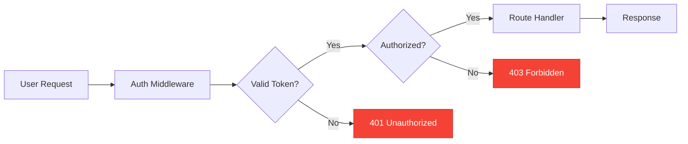

### Data Protection

| Layer | Protection Mechanism |
|-------|---------------------|
| **Transport** | TLS 1.3 encryption for all API calls |
| **Storage** | Encrypted S3 buckets for screenshots |
| **API Keys** | AWS IAM roles with least privilege |
| **Secrets** | Environment variables, no hardcoding |
| **Input Validation** | Pydantic models with strict validation |
| **Output Sanitization** | JSON schema validation |

### AWS Bedrock Security

- **IAM Policies:** Scoped to specific models and actions
- **VPC Endpoints:** Private connectivity to Bedrock
- **CloudTrail:** Full audit logging of API calls
- **Encryption:** Data encrypted at rest and in transit

---

## Scalability & Performance

### Horizontal Scaling Architecture

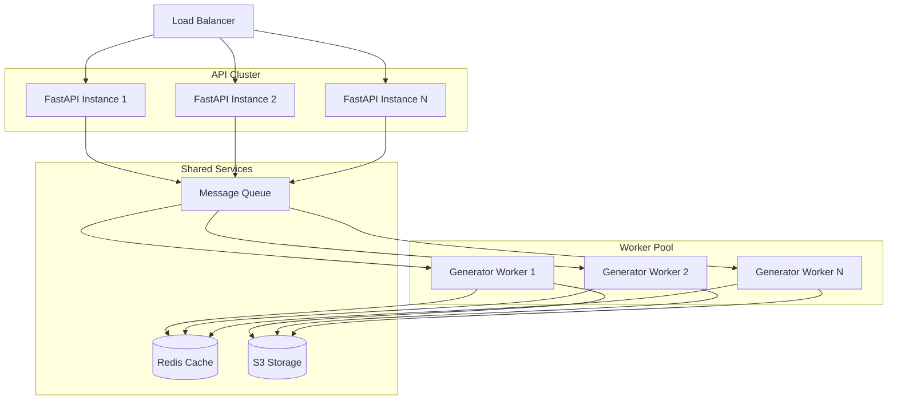

### Performance Optimizations

#### Caching Strategy

```python
# Redis cache for frequently accessed workflows
@cache(ttl=3600)
async def get_workflow(workflow_id: str) -> WorkflowDefinition:
    return await db.workflows.find_one({"id": workflow_id})

# In-memory cache for session data during generation
session_cache = TTLCache(maxsize=1000, ttl=300)
```

#### Async Processing

```python
# Concurrent screenshot processing
async def process_screenshots(screenshot_paths: List[str]) -> List[str]:
    tasks = [
        process_single_screenshot(path)
        for path in screenshot_paths
    ]
    return await asyncio.gather(*tasks)
```

#### Batch Processing

```python
# Batch multiple workflow generations
async def generate_workflows_batch(
    sessions: List[SessionTimeline]
) -> List[WorkflowDefinition]:
    # Process up to 10 concurrent Bedrock requests
    semaphore = asyncio.Semaphore(10)
    async def generate_with_limit(session):
        async with semaphore:
            return await generate_workflow(session)

    return await asyncio.gather(*[
        generate_with_limit(s) for s in sessions
    ])
```

### Performance Metrics

| Operation | Target Latency | Current p95 |
|-----------|---------------|-------------|
| Event capture | < 10ms | 3ms |
| Screenshot processing | < 100ms | 45ms |
| Workflow generation (deterministic) | < 200ms | 120ms |
| Workflow generation (AI) | < 5s | 2.3s |
| Workflow execution (per step) | < 500ms | 180ms |
| API response (non-generation) | < 100ms | 35ms |

---

## Deployment Architecture

### Production Deployment

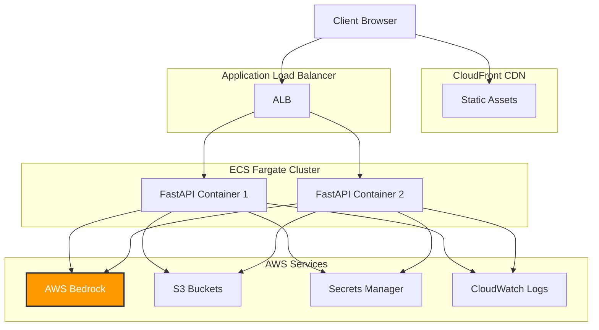

### CI/CD Pipeline

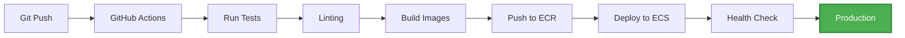

---

## Monitoring & Observability

### Metrics Dashboard

```typescript
// Key metrics tracked
const metrics = {
  api: {
    requests_per_second: Metric,
    error_rate: Metric,
    latency_p50: Metric,
    latency_p95: Metric,
    latency_p99: Metric
  },
  bedrock: {
    invocations_per_minute: Metric,
    tokens_consumed: Metric,
    cost_per_hour: Metric,
    error_rate: Metric
  },
  workflows: {
    generated_per_hour: Metric,
    execution_success_rate: Metric,
    average_steps: Metric
  }
}
```

### Logging Strategy

```python
# Structured logging with correlation IDs
logger.info(
    "workflow_generated",
    extra={
        "correlation_id": request.correlation_id,
        "session_id": session.id,
        "workflow_id": workflow.id,
        "generation_time_ms": generation_time,
        "step_count": len(workflow.steps),
        "model": "nova-pro-v1"
    }
)
```

---

## Technology Decisions & Trade-offs

### Why FastAPI?
✅ **Pros:** Async support, automatic OpenAPI docs, Pydantic integration
❌ **Cons:** Smaller ecosystem than Flask/Django
**Decision:** Performance and modern async patterns outweigh ecosystem size

### Why React over Vue/Svelte?
✅ **Pros:** Larger talent pool, extensive libraries, strong TypeScript support
❌ **Cons:** More boilerplate, larger bundle size
**Decision:** Industry standard with best tooling support

### Why AWS Bedrock over OpenAI?
✅ **Pros:** Multimodal support, AWS integration, enterprise SLAs
❌ **Cons:** Newer service, fewer models available
**Decision:** Multimodal capabilities and AWS ecosystem integration critical

### Why Pydantic v2?
✅ **Pros:** Performance, validation, JSON schema generation
❌ **Cons:** Breaking changes from v1
**Decision:** Performance gains and type safety worth migration cost

---

<div align="center">

**[Back to Main README](README.md)**

</div>
