# Visual Documentation & Diagrams

This document contains various diagrams and visual representations of the Shadow Worker system for presentations, documentation, and understanding the architecture.

---

## System Overview Diagrams

### Simplified System Flow

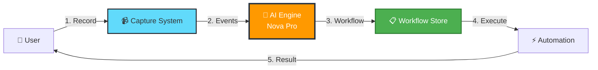

### Technology Stack Visualization

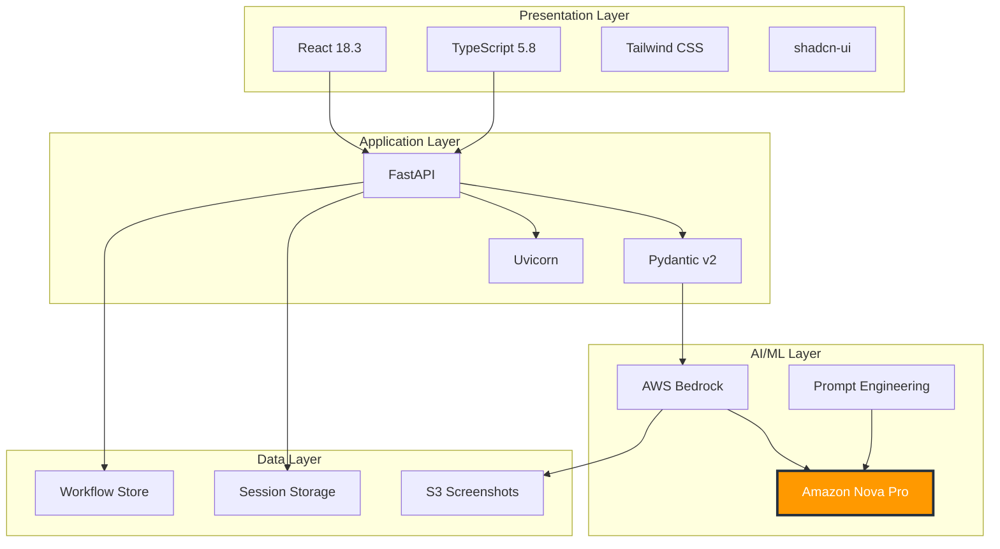

---

## AI/ML Pipeline Diagrams

### Multimodal Processing Flow

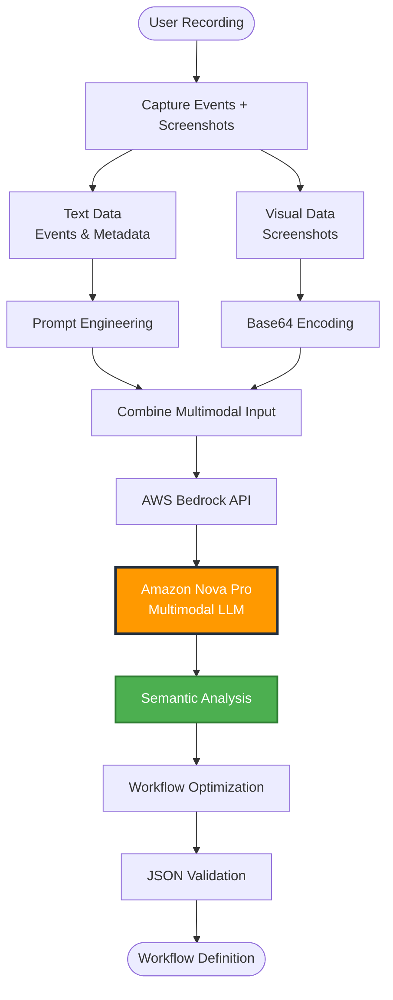

### Prompt Engineering Architecture

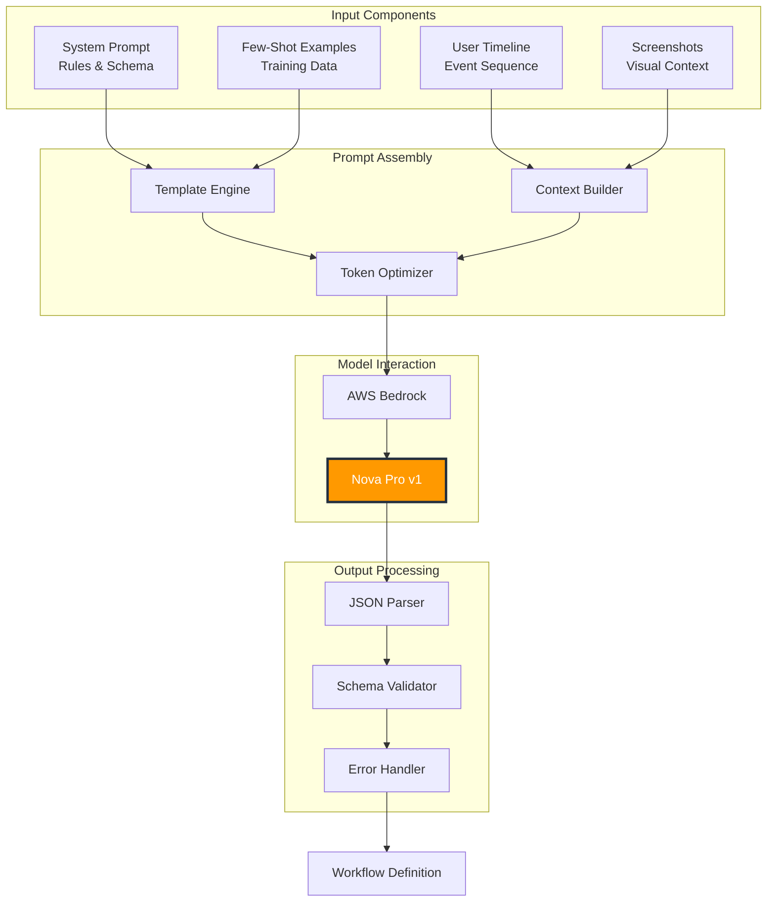

---

## Data Model Relationships

### Core Data Models

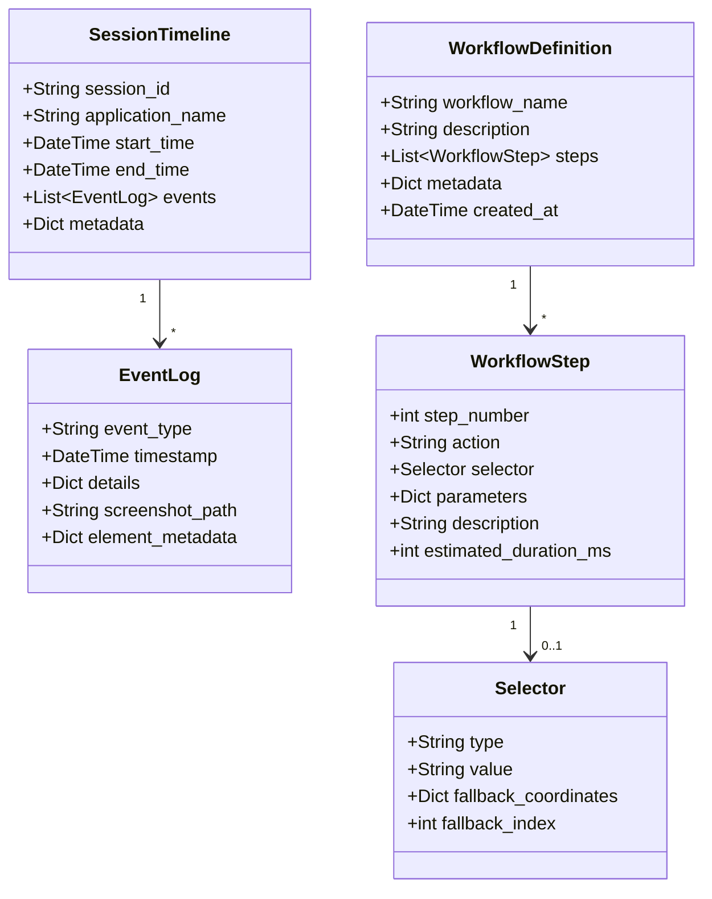

### State Machine for Workflow Execution

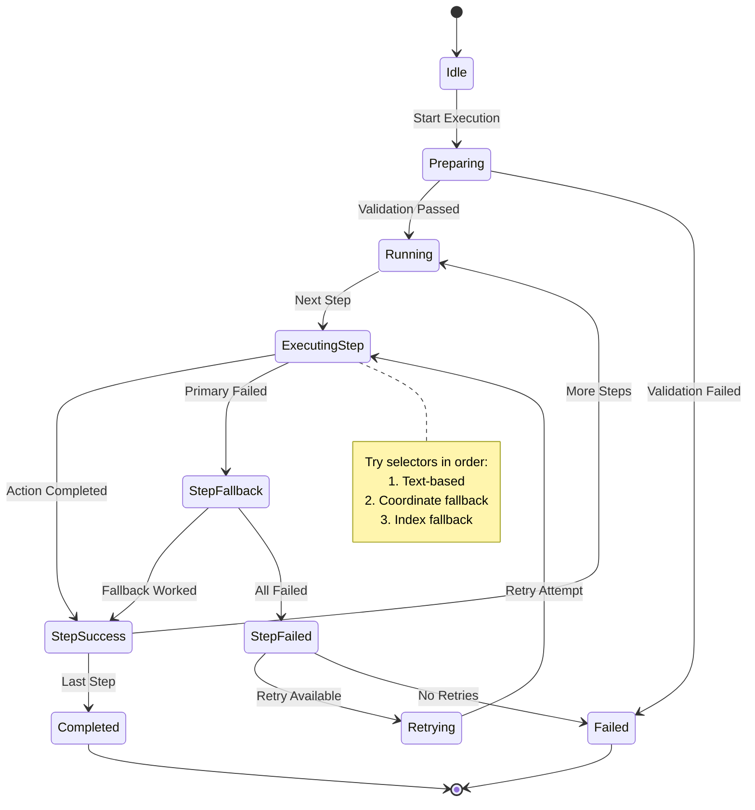

---

## Frontend Architecture

### Component Hierarchy

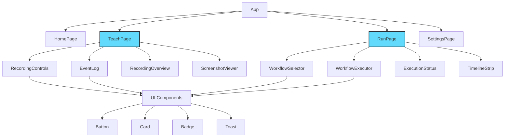

### State Management Flow

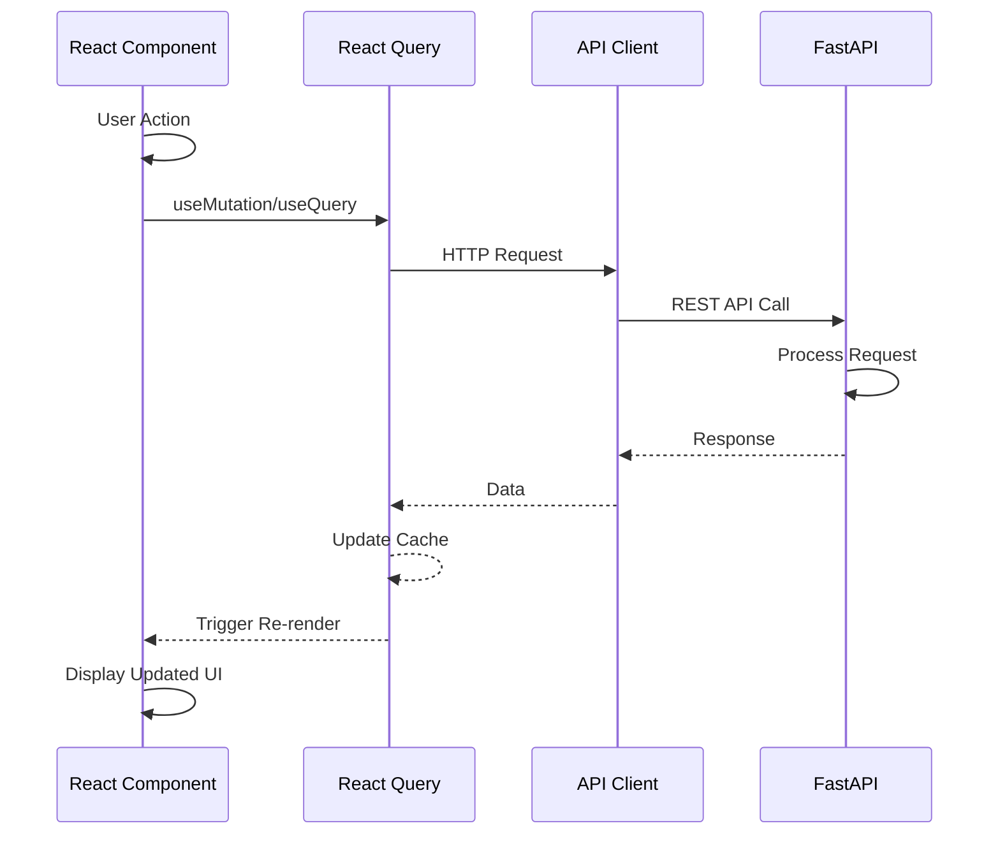

---

## Backend Architecture

### API Request Flow

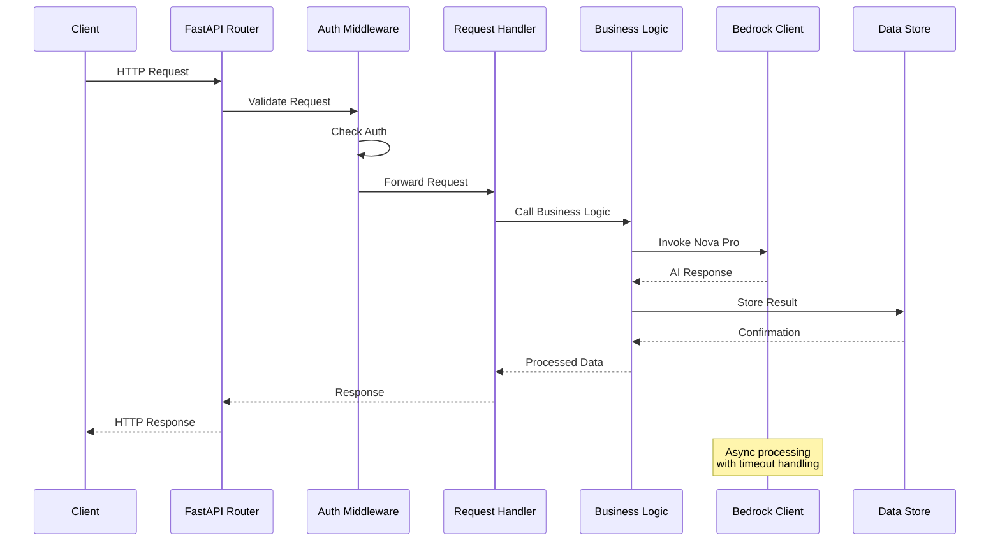

### Service Layer Architecture

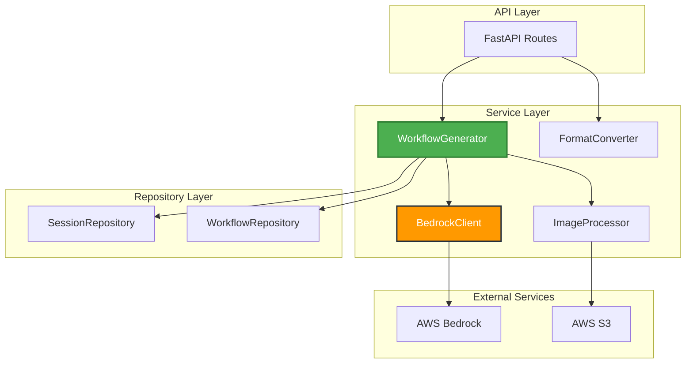

---

## Workflow Generation Process

### Complete Generation Pipeline

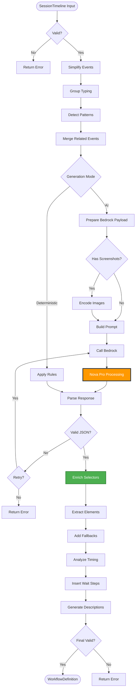

### Selector Enrichment Strategy

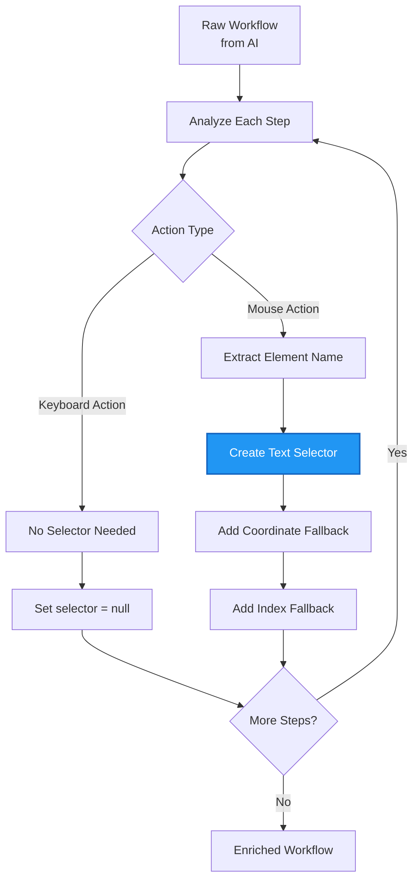

---

## Deployment Architecture

### AWS Infrastructure

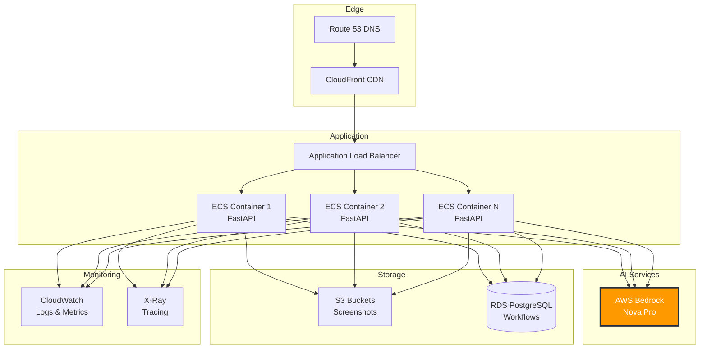

### CI/CD Pipeline

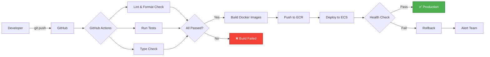

---

## Performance & Scalability

### Caching Strategy

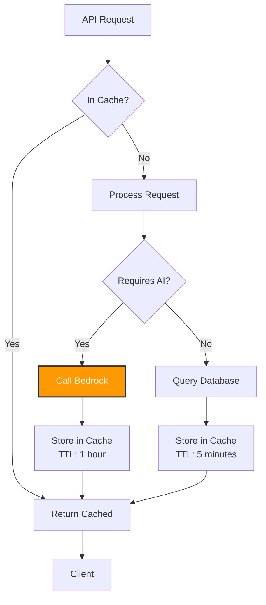

### Load Balancing

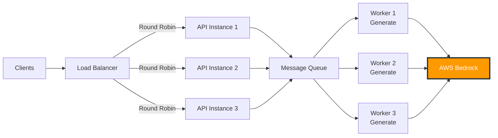

---

## Security Architecture

### Authentication Flow

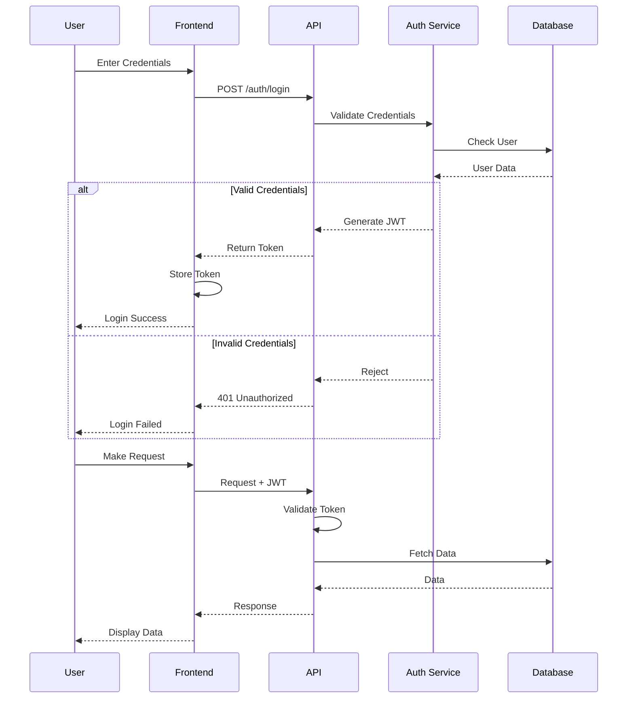

### Data Flow Security

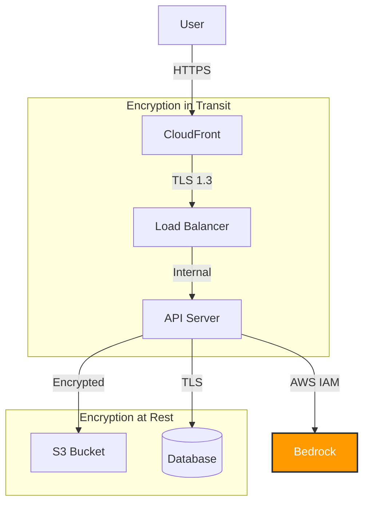

---

## Monitoring & Observability

### Metrics Dashboard

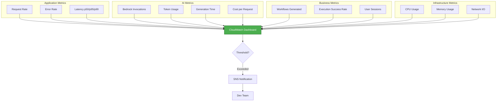

---

## User Journey Flow

### End-to-End User Experience

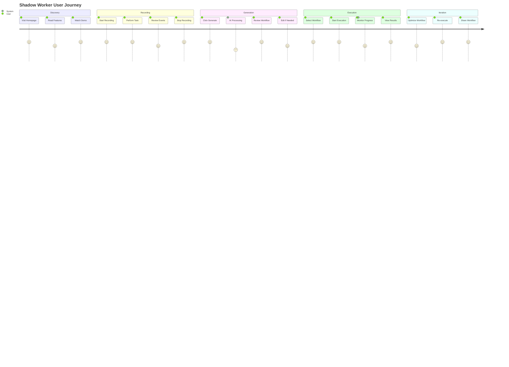

---

## Comparison Charts

### Traditional vs AI-Powered Automation

```mermaid
graph LR
    subgraph "Traditional Automation"
        T1[Manual Scripting] --> T2[Brittle Selectors]
        T2 --> T3[High Maintenance]
        T3 --> T4[Technical Skills Required]
    end

    subgraph "Shadow Worker"
        S1[Record Once] --> S2[AI Optimization]
        S2 --> S3[Self-Healing]
        S3 --> S4[No Coding Required]
    end

    style S1 fill:#4CAF50,stroke:#2E7D32,stroke-width:2px,color:#fff
    style S2 fill:#FF9900,stroke:#232F3E,stroke-width:2px,color:#fff
    style S3 fill:#2196F3,stroke:#1565C0,stroke-width:2px,color:#fff
```

---

<div align="center">

**These diagrams can be exported as images for presentations using Mermaid Live Editor**

[Mermaid Live Editor](https://mermaid.live)

**[Back to Main README](README.md)** | **[Architecture Details](ARCHITECTURE.md)**

</div>
